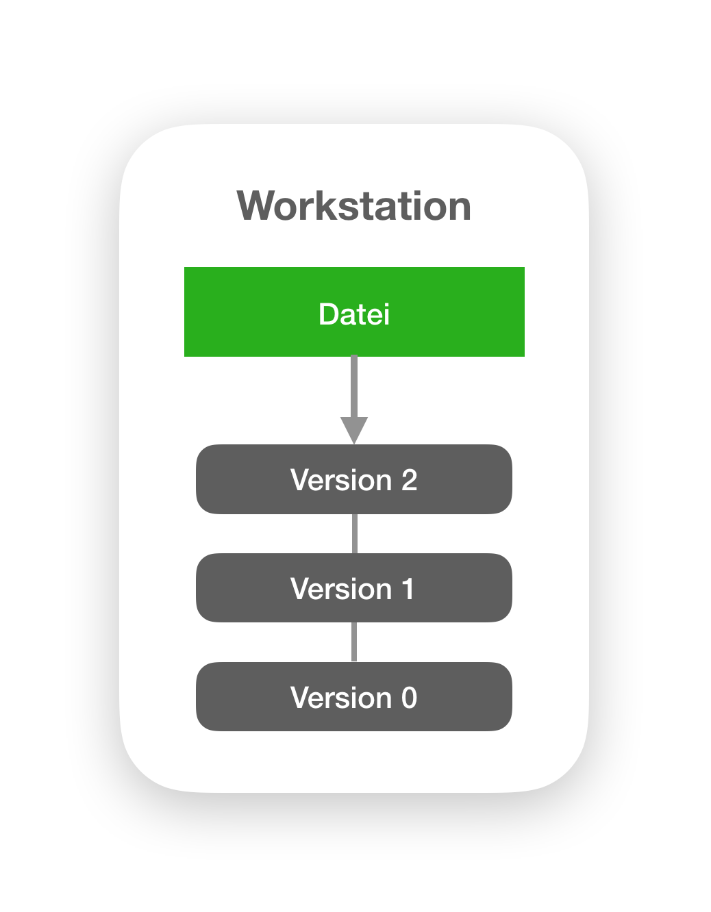
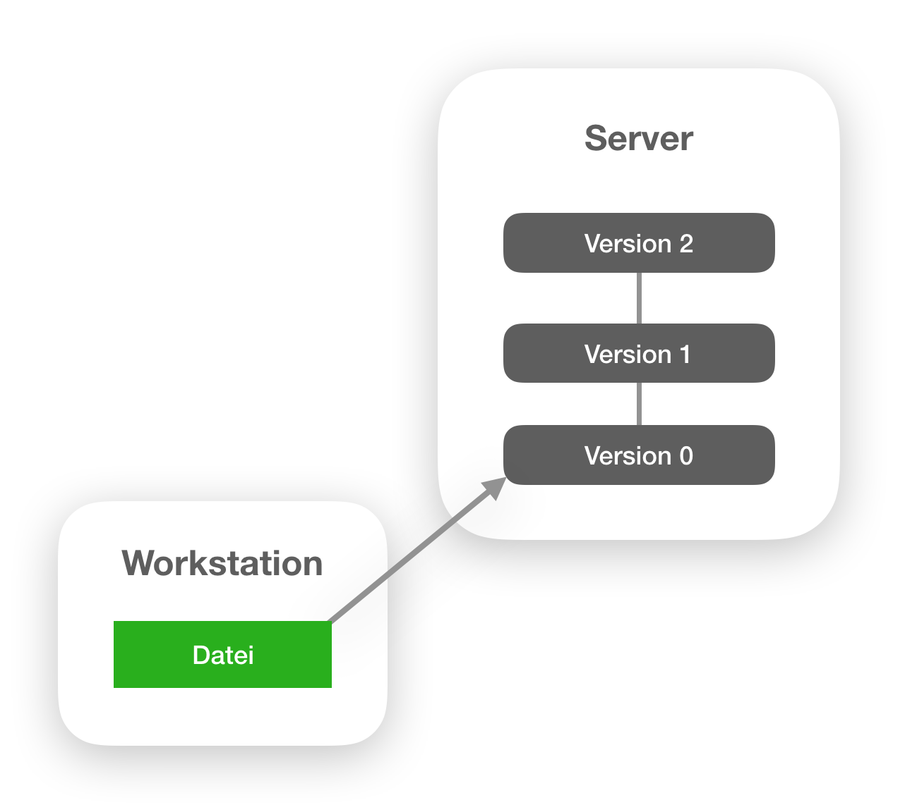
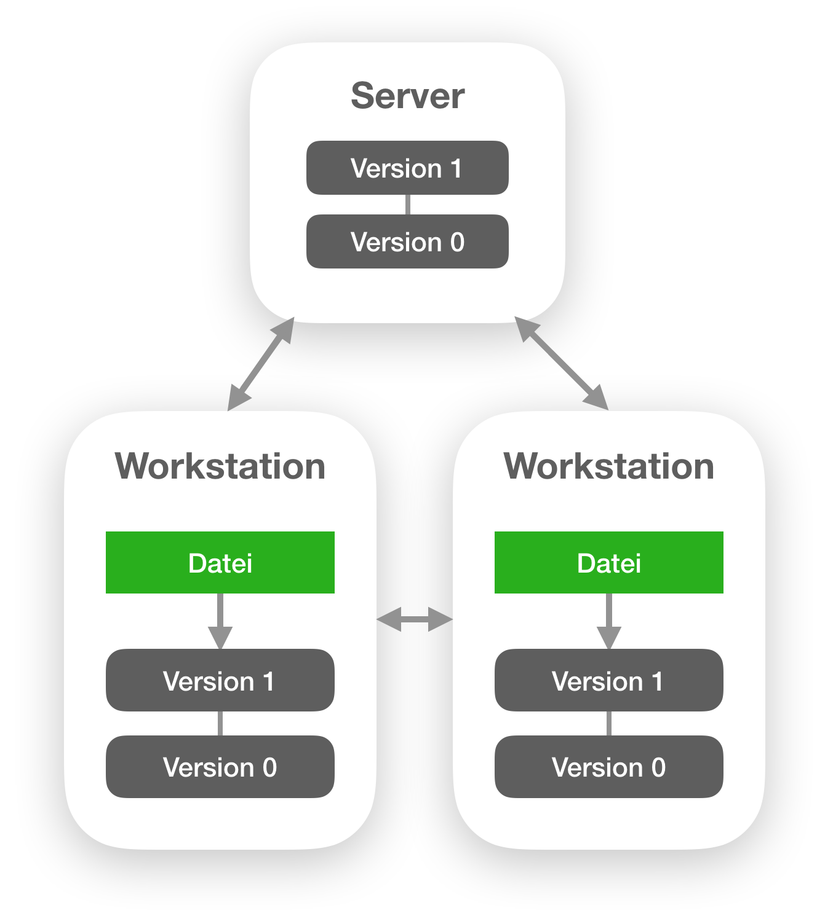
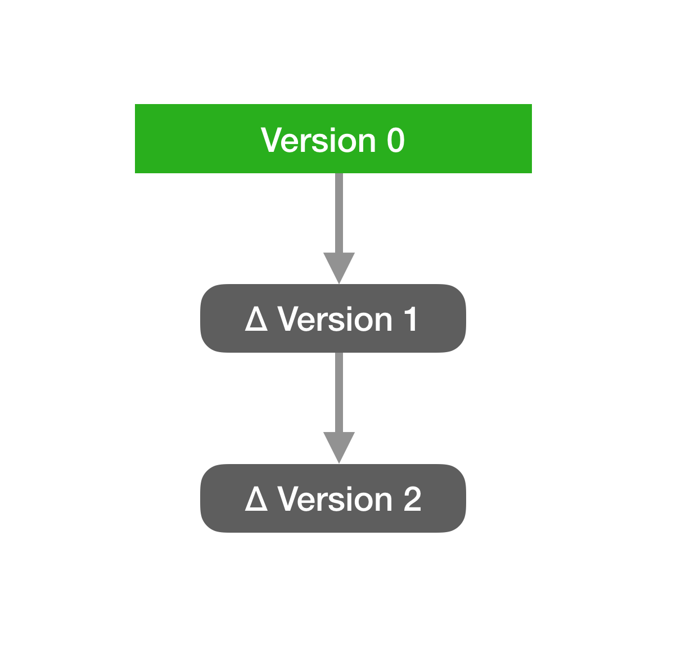
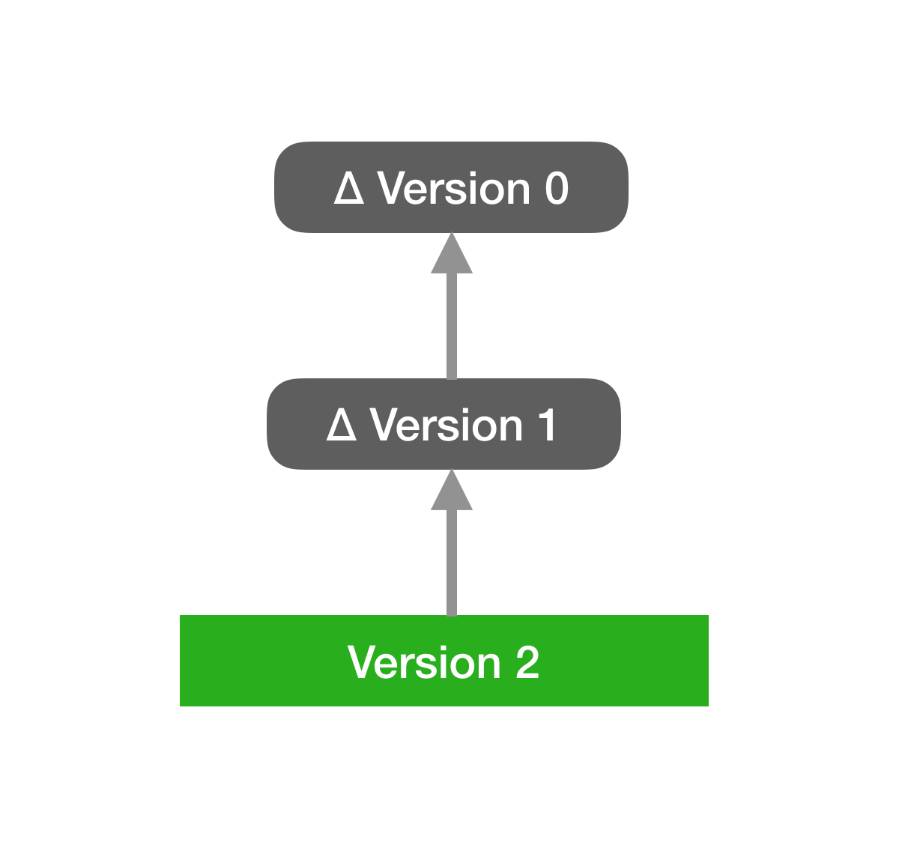
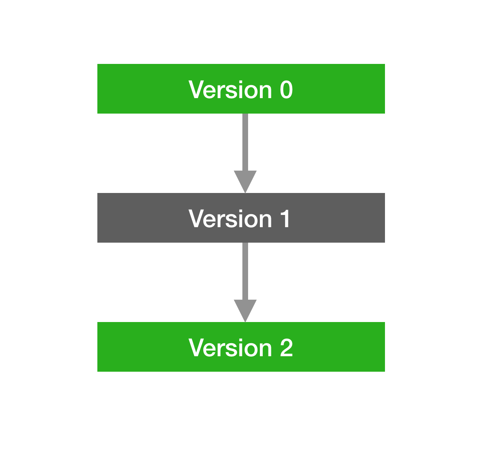

Ein Überblick über Code- und Versionsverwaltungssysteme
=================================================
*[Zur Themenübersicht](../../themen.md)*

Inhalt
------
1. [Einleitung](#einleitung)
2. [Zielgruppe von Versionsverwaltungssystemen](#zielgruppe)
3. [Grundlegende Strukturen von VCS](#strukturen)
4. [Speicherung der Versionen](#speicherung)

Einleitung
----------

Versionsverwaltungssysteme (kurz VCS) sind Systeme, die Änderungen in Dateien ablegt, um es zu ermöglichen später zu einem älteren Zustand zurückzukehren. ([Git](https://git-scm.com/book/en/v2/Getting-Started-About-Version-Control))
Das bedeutet insbesondere, dass Fehler rückgängig gemacht werden können und deine Kollegen gleichzeitig möglichst ungestört weiterarbeiten können. ([Atlassian](https://www.atlassian.com/git/tutorials/what-is-version-control))

Jeder hat vermutlich schon einmal mit solch einem Versionsverwaltungssystem zu tun gehabt, oder gearbeitet. Dabei stellt sich beim Starten eines neuen Projekts  häufig die Frage, welches Versionsverwaltingssystem für das Projekt genutzt werden soll. Oft wird bei auf diese Frage mit dem System namens Git geantwortet, da dies das am weitesten verbreitete und am meisten verwendete Versionsverwaltungssystem ist. Es existieren somit auch sehr viele Online Services, die einen hosting Service von Online Git Repositorys zur Verfügung stellen. Eines dieser Systeme ist Github. Github biete die Möglichkeit kostenlos öffentliche Git Repositorys zu erstellen, die genutzt werden können, um den eigenen Code zu verwalten. Somit ist Github eine der größten Plattformen für Open Source Software. Ähnlich sieht es bei anderen Anbietern solcher Services, wie GitLab aus. Auch die Verteilung von freier Software werden häufig solche Services verwendet. Versionsverwaltungssysteme scheinen also nicht unbedeutend für die Existenz von Open Source Projekten zu sein.

Um die Frage darüber, welches Versionsverwaltungssystem man für eigene Projekte verwendet, etwas differenzierter als nur mit "Git" zu beantworten zu konnen und die Vor- und Nachteile der Verschiedenen Versionsverwaltungssysteme zu verstehen, soll diese Arbeit einen kleinen Überblick über die verschiedenen Versionsverwaltungssysteme inklusive deren Stärken und Schwächen geben.

Zielgruppe von Versionsverwaltungssystemen
------------------------------------------

Auf Versionsverwaltungssysteme stößt man zwar besonders häufig in der Softwareentwicklung, aber auch in anderen Bereichen ergibt ein Einsatz solcher Systeme Sinn. Ein Beispiel wäre die Hardwareentwicklung. Dort gibt es viele Ansätze auch Versionsverwaltungssysteme zu nutzen, die ursprünglich für die Softwareentwicklung entworfen wurden. ([ERPNext](https://discuss.erpnext.com/t/erpnext-git-github-for-open-source-hardware-call-for-beta-user-s/18006)) Auch für Webdesigner und alle anderen, die mit sich ändernden Dateien Arbeiten ist der Einsatz von Versionsverwaltungssysteme sinnvoll und vereinfacht die Arbeit an vielen Stellen.

In dieser Arbeot werde ich jedoch besonder auf die Sicht der Programmierung eingehen, da es für das Thema der Open Source Software am interessantesten ist. Die Versionsverwaltungssysteme, die ich in dieser Arbeit beschreiben werde, verwalten also Source Code und werden somit auch Codeverwaltungssysteme genannt.

Grundlegende Strukturen von VCS
-------------------------------

Um den Vergleich zwischen Versionsverwaltungssystemen zu ermöglichen, werden Informationen über die interne Struktur solcher Systeme benötigt, da aus der internen Struktur auch direkt Ideen und Ansätze für die Schnittstelle des jeweiligen Systems folgen. Außerdem sind die internen Strukturen nicht unwichtig für den Workflow, den diese Versionsverwaltungssysteme haben.

Grundsätzlich existieren drei Aufbauten von Versionsverwaltungssystemen. Dazu gehört der lokale, der zentralisierte und der verteilte Ansatz des Aufbaus.

Beim lokalen Ansatz handelt es sich um den einfachsten der drei Ansätze. Er basiert darauf, dass alle Änderungen lokal abgelegt und verwaltet werden. Dies ist in dieser Abbildung vereinfacht veranschaulicht:

Versionen beschreiben hierbei Zustände der versionierten Datei, auf die die aktuelle Datei zurückgesetzt werden kann. In diesem Diagramm kann man sehr gut erkennen, dass alle Versionen lokal auf dem Rechner abgelegt sind und die aktuell genutzte Datei auf einer Version aus der Datenbank basiert. Nachteile hierbei sind zum Beispiel, dass Änderungen nicht mit anderen Synchronisiert werden, sodass ein Arbeiten im Team mit diesem Ansatz nicht besonders angenehm sein kann. Auch besteht das Problem, dass bei einem Defekt des Datenspeichers des Rechners direkt alle Daten und Versionen verloren sind. Eine Lösung für dieses Problem wären Backups, welche jedoch gegen den Sinn eines Versionsverwaltungssystems stehen.

Der Zentrale Ansatz versucht, das Problem der Zusammenarbeit zu beheben und damit eine solche Zusammenarbeit am selben Projekt problemlos und möglichst konfliktfrei zu ermöglichen. Dabei werden alle Versionen auf den Server ausgelagert. Die aktuell bearbeiteten Dateien liegen aber bei den Clients, verweisen aber auf die Version, auf der sie basieren, welche auf dem Server liegt. Die folgende Abbildung stellt diesen Aufbau vereinfacht dar:

Ein Nachteil dieses Ansatzes ist, dass das offline Arbeiten insofern nicht möglich ist, dass offline keine neue Versionspunkte erstellt werden können. Außerdem besteht auch hier noch das bereits genannte Problem der Datenverluste durch Defekte des Rechners, der die Versionen hält.

Die dritte und damit letzte Möglichkeit, ein Versionsverwaltungssystem zu modellieren, die ich vorstelle, versucht die Vorteile des zentralen Ansatzes auszunutzen und gleichzeitig die negativen Punkte zu verbessern. Dieser Ansatz ist der dezentrale Ansatz.

Bei diesem Ansatz Liegen alle Versionen sowohl bei den Clients, als auch auf den Servern. Die lokalen Arbeitskopien sind nur auf den Clients vorhanden und verweisen auf die Version des Clients, auf der sie basieren. Zudem werden Versionen zwischen Server und Clients synchronisiert. Auch die Synchronisierung direkt unter den Clients ist möglich.

Durch diese Struktur wird es möglich, offline neue Versionen zu erstellen und auch auf ältere Versionen zuzugreifen. Die synchronisierung ist weiterhin nur Online möglich. Auch das Problem der Datenverluste wird durch dieses System behoben, da beim Datenverlust eines Teilnehmers dieses Systems die Daten mit einem anderen Teilenhmer wieder synchronisiert werden können, wodurch die Daten in den meisten Fällen wiederhergestellt werden können.

Speicherung der Versionen
-------------------------

In der letzten Sektion war wiederholt die Rede von Versionen. Dabei stellt sich die Frage, wie solche Versionen auf dem Rechner dargestellt und abgespeichert werden.

Auch hierbei gibt es verschiedene Ansätze, welche einmal die Deltas und einmal die Snapshots sind.
Die Deltas lassen sich dabei weiter in Vorwärts- und Rückwärtsdeltas aufteilen. 

Bei Vorwärtsdeltas ist die zuerst erstellte Version einer Datei vollständig abgespeichtert. Alle darauffolgenden Versionen sind nur als meist zeilenweise Unterschiede zu ihrem Vorgängerzustand abgelegt. Dadurch wird der Zugriff auf ältere Versionen schneller und der Zustand auf neuere Zustände verzägert sich.
Die folgende Abbildung zeigt einen solchen Aufbau. Dabei ist das grün markierte Element komplett abgespeichert und die grauen Elemente sind Deltas.

Rückwärtsdeltas arbeiten genau in die entgegengesetzte Richtung. Bei ihnen ist der neuste Zustand komplett abgespeichert und alle Vorgängerversionen sind mit Unterschieden zu iherer Nachfolgerversion versehen. Das führt zu einem schnellen Zugriff auf die neueren Versionen und einem umso Langsameren auf die älteren Versionen.
Diese Abbildung zeigt reverse Deltas:

Welcher der beiden Deltas nun besser ist, kommt ganz auf den Anwendungsfall an. In den meisten Fällen wird jedoch ein Zugriff auf die neueren Versionen häufiger vorkommen als ein Zugriff auf die älteren Versionen, weshalb meistens die Rückwärtsdeltas zu empfehlen sind.

Ein Nachteil dieser Delta Repräsentation ist jedoch, dass für den Fall eines Datenverlusts in einer Version alle Versionen, die von dieser fehlerhaften Version ableiten, ebenfalls fehlerhaft sind. Es existieren jedoch Ansätze und Implementation, die dieses Problem weniger kritisch machen.

Als alternative zu den Deltas existiert auch die Versionssicherung durch Shapshots. Hierbei wird jede Version einzeln Abgespeichert, oder die vorherige Version referenziert, falls es keine Änderungen in der jeweiligen Datei gab. Im Fall einer Referenzierung wird nicht wieder die gesammte Datei abgespeichert, sondern nur eine Referenz auf die letzte Version der jeweiligen Datei.
Die folgende Abbildung stellt diese Snapshots dar. Dabei sind grau markierte Elemente referenzierte Versionen und grün markierte Elemente als Snapshot ablegt. die Version 0 ist die erste Version und die Version 2 die Aktuellste.

Vorteile dieser Repräsentation sind z.B. die Sicherheit vor Fehlern in einer Version. Tritt nämlich ein Datenverlust in einer Version auf, ist nur diese Version und gegebenenfalls die diese Version referenzierenden Versionen betroffen. Ein großer Nachteil ist aber die der Speicherverbrauch, welcher um einiges größer ausfällt as bei Deltas.