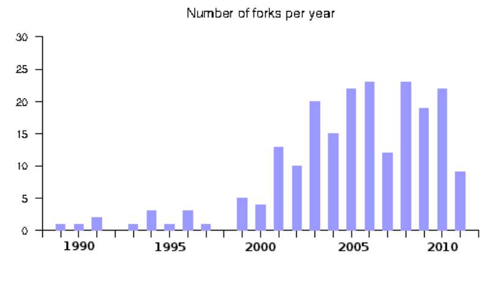
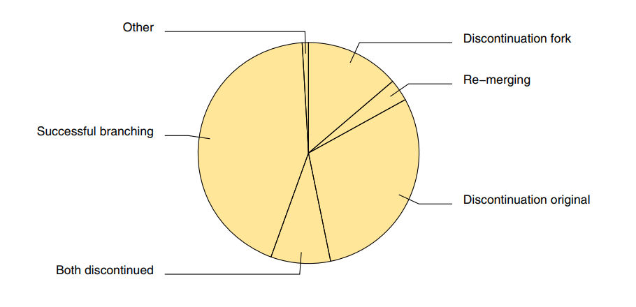

Projektzusammenhänge
====================
*[Zur Themenübersicht](../../themen.md)*

Inhalt
======
1. *[Einleitung](#einleitung)*
2. *[Was ist ein Fork?](#was-ist-ein-fork)*
2. *[Untersuchung von Forks](#studie-über-forks)*
3. *[Bekannte Forks](#bekannte-forks)*
4. *[Fazit](#fazit)*

Einleitung
==========
Die meisten Free/Libre Open Source Software (FLOSS) Projekte stehen im Zusammenhang zu anderen FLOSS-Projekten.
Diese Zusammenhänge können aus unterschiedlichen Formen bestehen. Zum einen werden andere FLOSS-Projekte als Tools
in der Entwicklung (zum Beispiel als Compiler, Paketmanager) genutzt. Auch ist es üblich andere FLOSS-Projekte als
Software-Bibliothek einzubinden. Des weiteren kann der Fall auftreten, dass ein anderes FLOSS-Projekt als Inspiration
gilt oder die selben Features bietet. Ein besonderes Phänomen in freier Software ist das Konzept der Forks, auf die in
diesem Dokument genauer eingegangen werden soll.

Was ist ein Fork?
=================
Als Fork wird in der freier Software ein Projekt bezeichnet, welches sich von einem vorher bereits bestehendem Projekt
abgespalten hat und von einer neuen Community betreut wird, die unabhängig vom ursprünglichen Projekt ist.
Der Begriff "Fork" stammt hierbei aus dem POSIX Standard für Betriebssysteme. In diesem ist der Aufruf "fork()"
so definiert, dass der aktuelle Prozess eine Kopie von sich selbst erzeugt. Daraus entstehen zwei Kopien dieses
Prozesses, die unabhängig von einander sind. Diese Analogie trifft auch auf Forks in freier Software zu.
Hier existieren, nachdem ein fork durchgeführt wurde, zwei unabhängige Projekte, die zu einem Zeitpunkt die selbe Code
Basis hatten. Dieses forken ist ein grundlegendes Recht in freier Software. Jedoch soll von diesem Recht nicht ohne
gutem Grund Gebrauch gemacht werden. Es sollte eher als ein letzter Ausweg gelten, wenn Konflikte oder
Meinungsverschiedenheiten nicht anders gelöst werden können. Ursprünglich war der Prozess des forken dazu gedacht um
Entwicklern die Möglichkeit zu geben, nicht mehr betreute Projekte weiter entwickeln zu können.

Studie über Forks
================
Im Jahr 2012 wurde das Paper **A Comprehensive Study of Software Forks: Dates, Reasons and Outcomes** von den
Wissenschaftlern **Gregorio Robles** und **Jes´us M. Gonz´alez-Barahona** der King Juan Carlos Universität in Madrid
veröffentlicht. Die Wissenschaftler haben hier Forks näher untersucht und sich dabei auf vier Fragen
konzentriert, die beantwortet werden sollten. Diese Fragen und die Ergebnisse der spanischen Wissenschaftler
werden in den nächsten Abschnitten genauer Erläutert.

Wie viele (relevante) Forks gibt es?
------------------------------------
Zuerst wurde die Frage gestellt, wie viele Forks insgesamt existieren. Dabei war die Hypothese die
aufgestellt wurde, dass Forks selten auftreten. Da Forks in der Open Source Community ein sensibles Thema sind und nur
akzeptiert werden, wenn ein starker Grund für das forken besteht, ist diese Hypothese nachvollziehbar.
Für die Beantwortung dieser Frage haben die Wissenschaftler alle relevanten Forks in der Geschichte freier Software
analysiert. Hierbei wurde relevant auf die Weise definiert, dass ein Fork als relevant gilt, wenn im englischen
Wikipedia ein Eintrag zu diesem Projekt zu finden ist. Dadurch fanden die Wissenschaftler 235 potentielle Forks,
von denen 220 tatsächlich eigenständige Forks sind. Außerdem wird in dem Paper angemerkt, dass Projekte, aus denen
einmal ein Fork entstanden ist dazu tendieren häufiger geforked zu werden. Eine Begründung hierfür sei, dass wenn
bereits einmal der Schritt des forkens gegangen wurde es nicht mehr so starke Begründungen für einen weiteren Fork
bedarf, um akzeptiert zu werden. Außerdem wurden Forks in allen Bereichen von freier Software gefunden, womit diese
nicht auf bestimmte Bereiche festgelegt sind.

Entstehen heutzutage häufiger Forks?
------------------------------------
Die zweite Hypothese, die aufgestellt wurde war, dass heutzutage häufiger Forks entstehen. Eine Begründung hierfür sei
laut den Wissenschaftlern zum einen, dass die absolute Anzahl an FLOSS-Projekten exponentiell gestiegen ist in den
letzten Jahren. Da wäre es nur naheliegend, dass die Anzahl an Forks ebenfalls ansteigt.
Außerdem werden heutzutage immer mehr FLOSS-Projekte von Firmen betreut, was dazu führen kann, dass die Firma andere
Interessen verfolgt, als die Community des Projekts und deshalb häufiger Forks entstehen.

In dem folgenden Diagramm haben die Wissenschaftler dargestellt, wie das Wachstum an Forks seit 1989 bis 2012 verlief.
Dies war der Zeitraum seit dem ersten Fork:

Aus den Ergebnissen heraus wird deutlich, dass die Anzahl an Forks im Laufe der Jahre zwar deutlich gestiegen ist,
jedoch nicht proportional zum Wachstum der Anzahl an FLOSS-Projekten. Stattdessen stieg die Anzahl an Forks eher linear
und nicht exponentiell.

Was sind die Gründe Für Forks?
------------------------------
Eine weitere Frage, die von den Wissenschaftlern beantwortet werden sollte, war nach den Gründen für die Entstehung
von Forks. Hierfür wurden zunächst sechs Kategorien von Gründen definiert, aufgrund dessen ein Projekt geforked werden
kann:
- **Technical:** Alle technischen Gründe betreffend Implementation oder Funktionsweise des Projekts.
- **More community-driven development:** Die Community wird nicht genug einbezogen in die Entwicklung des Projekts.
Dies entsteht vor allem bei FLOSS-Projekten, die von Firmen oder einem einzelnen Maintainer betreut werden.
- **Discontinuation of the original project:** Das ursprüngliche Projekt wird nicht weiter betreut und es entsteht eine
neue Community, die das Projekt weiterführen.
- **Commercial strategy forks:** Ein Fork entsteht auf Grund einer kommerziellen Strategie für das Projekt.
- **Legal issues:** Lizenz Wechsel, Markenrechte oder Änderungen aufgrund von Gesetzen.
- **Differences among developer team:** Die Gruppe von Entwicklern, die das Projekt betreuen sind sich nicht einig über
ein spezielles Thema, welches kein direktes technisches Thema ist.

Nachdem diese Kategorien definiert wurden haben die Wissenschaftler alle Forks, für die Sie einen Grund finden konnten,
jeweils einer Kategorie zugeordnet. Im folgenden sind die Ergebnisse der Analyse in einer Tabelle dargestellt:

Es war hierbei möglich bei 9 von 10 Forks den Grund für die Entstehung des Forks heraus zu finden. Der häufigste Fall
ist dabei ein technischer Beweggrund. Jedoch sind die Gründe weites gehend über alle Kategorien verteilt.

Was ist das Resultat von Forks?
-------------------------------
Die letzte Frage betrifft das Resultat von Forks. In dem Paper wird eine Hypothese von David A. Wheeler aufgegriffen.
Wheeler hat in einem Paper von 2006 vier mögliche Resultate für jeden Fork definiert. Dabei hat er ebenfalls die
Hypothese aufgestellt, das sterben des Forks sei das am häufigsten auftretende Resultat.
Um diese Hypothese zu prüfen haben die Wissenschaftler alle Forks nach den folgenden Kategorien von Wheeler
eingeordnet, wobei die letzte Kategorie hinzugefügt wurde:
- Der Fork stirbt.
- Das ursprüngliche Projekt stirbt.
- Die beiden Projekte werden wieder zusammen geführt.
- Erfolgreiches fortbestehen beider Projekte (Branching).
- Beide Projekte sterben.

Die Ergebnisse wurden in folgendem Diagramm dargestellt:

Anhand der Ergebnisse wird klar, dass die ursprüngliche Hypothese von Wheeler nicht zu trifft. Stattdessen ist der
am häufigsten auftretende Fall, der des erfolgreichen Branchings. An zweiter Stelle steht in dem Diagramm der Fall,
dass das ursprüngliche Projekt stirbt. Es werden jedoch auch Projekte in dieser Kategorie aufgeführt, die bereits
gestorben sind bevor der Fork entstanden ist. Deshalb kann es als ungefähr gleich wahrscheinlich betrachtet werden,
dass nachdem ein Fork entstanden ist, das ursprüngliche Projekt oder der Fork stirbt.

Bekannte Forks
==============
Im folgenden sollen zwei FLOSS-Projekte vorgestellt werden, die Forks sind. Dabei wird beschrieben was die Gründe
für die Entstehung sind und wie der Fork verlaufen ist.

MariaDB
-------
MariaDB ist ein Relationales Datenbank Managment System (RDBMS) und ist als Fork von dem bekannten Open-Source RDBMS
MySQL entstanden. Die Abspaltung fand 2009 statt. Der Grund für diesen Fork ist die Übernahme von Sun Microsystems
durch Oracle. Nach dieser Übernahme war nun auch Oracle verantwortlich für MySQL. Viele Entwickler, unter anderem
Michael Widenius der Gründer von MySQL, sahen Oracle kritisch im Umgang mit Open-Source Projekten. Deshalb wurde MySQL
von Widenius geforked und MariaDB ist entstanden. Die MariaDB Foundation entstand kurz nach der Entstehung des Forks
und ist der offizielle Maintainer des Projekts.
Der Grund für diesen Fork fällt deshalb in die Kategorie "More community-driven development".
Das Resultat ist ein erfolgreiches Branching, denn beide Projekte bestehen bis heute und sind viel genutzte
FLOSS-Projekte.

Devuan
------
Devuan ist eine Linux Distribution, die ein Fork der bekannten Distribution Debian ist. In der 8. Version von Debian
wurde entschieden, das init-System SysVinit durch das modernere Programm Systemd auszutauschen.
Viele Entwickler haben diese Entscheidung nicht befürwortet. Dies liegt vor allem daran, dass Systemd in der freien
Software Community sehr kontrovers ist. Denn es bricht mit einem UNIX Grundsatz, nachdem Programme nicht zu komplex
werden sollen durch die Konzentration auf eine bestimmte Funktion. Daraus entstand ein Streit unter den Entwicklern,
der darin Resultierte, dass 2014 Devuan als Fork von Debian gegründet wurde mit SysVinit als init-System.
Der Grund für diesen Fork ist in die Kategorie "Technical" ein zu ordnen.
Das Resultat ist ebenfalls ein erfolgreiches Branching, wobei viele Leute skeptisch sind ob die Community des
Devuan Projekts groß genug ist für die Pflege einer Linux Distribution.

Fazit
=====
Es gibt viele Arten von Zusammenhängen einzelner FLOSS-Projekten. Dabei hebt sich der Fork von den übrigen Arten ab.
Der Prozess des forkens Charakterisiert die fundamentale Freiheit von FLOSS-Projekten. Dies wird ebenfalls dadurch
deutlich, dass forken ein grundlegendes Recht in freier Software ist. So kann sich ein neues Projekt mit eigener
Community aus einem Projekt heraus bilden, das vorher bereits nicht mehr aktiv Weiterentwickelt wurde. Außerdem
kann die Community ein neues Projekt von der bestehenden Codebasis starten, wenn Sie andere Interessen für das
Projekt verfolgt als der einzelne Maintainer oder die Firma hinter dem FLOSS-Projekt. Im Allgemeinen treten
Forks jedoch sehr selten auf. Dies liegt vor allem daran, dass in der freien Software Community Forks eher kontrovers
sind und weites gehend vermieden werden.

Quellen
=======
- [A Comprehensive Study of Software Forks: Dates, Reasons and Outcomes](https://gsyc.urjc.es/~grex/oss2012forking)
- https://dwheeler.com/oss_fs_why.html#forking
- https://lwn.net/Articles/329626/
- https://de.wikipedia.org/wiki/MariaDB
- https://mariadb.org/
- https://devuan.org/
- https://en.wikipedia.org/wiki/Devuan
