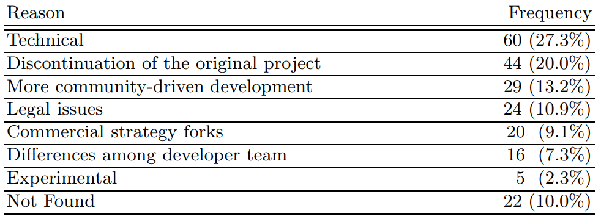

Projektzusammenhänge
====================
*[Zur Themenübersicht](../../themen.md)*

Inhalt
======
1. *[Einleitung](#einleitung)*
2. *[Was ist ein Fork?](#)*
2. *[Untersuchung von Forks](#)*
3. *[Bekannte Forks](#)*
4. *[Fazit](#fazit)*

Einleitung
=====
Es liegt in der Natur von Free/Libre Open Source Software (FLOSS), dass diese im Zusammenhang stehen zu
anderen FLOSS-Projekten. Diese Zusammenhänge können aus unterschiedlichen Formen bestehen.
Zum einen könnten andere FLOSS-Projekte als Tools in der Entwicklung (zum Beispiel ein Compiler, Paketmanager etc)
genutzt werden. Oder das Einbinden einer Software-Bibliothek auf die innerhalb des Projektes zu gegriffen wird.
Außerdem kann ebenfalls der Fall auftreten, dass ein anderes FLOSS-Projekt als Inspiration oder direkter Konkurrent
auftritt. Des weiteren gibt es das Phänomen der Software-Forks, auf die in dem folgenden Dokument genauer eingegangen
werden soll.

Was ist ein Fork?
=================
Als Fork wird in der Open-Source Community ein FLOSS-Projekt bezeichnet, welches sich von einem vorher bereits
bestehendem Projekt abgespalten hat und von einer, unabhängig vom original Projekt, neuen Community betreut wird.
Der Begriff "Fork" stammt hierbei aus dem POSIX Standard für Betriebssysteme. In diesem ist der Aufruf "fork()"
so definiert, dass der aktuelle Prozess eine Kopie von sich selbst erzeugt und darauf hin existieren zwei Kopien
dieses Prozess, die unabhängig von einander sind. Diese Analogie trifft auch auf Forks in FLOSS-Projekten zu.
Hier existieren nach einem Fork zwei unabhängige Projekte, die zu einem Zeitpunkt die selbe Code Basis hatten.
Dieses forken ist ein grundlegendes Recht in freier Software. Jedoch soll von diesem Recht nicht ohne gutem Grund
Gebrauch gemacht werden. Es soll eher als ein letzter Ausweg gelten, wenn Konflikte oder Meinungsverschiedenheiten
nicht anders gelöst werden können. Ursprünglich war der Prozess der forken dazu gedacht um Projekte, die nicht mehr
betreut werden weiter zu entwickeln durch andere Entwickler.

Untersuchung von Forks
======================
Im Jahr 2012 wurde das Paper **A Comprehensive Study of Software Forks: Dates, Reasons and Outcomes** von den
Wissenschaftlern **Gregorio Robles** und **Jes´us M. Gonz´alez-Barahona** der King Juan Carlos Universität in Madrid
veröffentlicht. Die Wissenschaftler haben hier Software-Forks näher untersucht und sich dabei auf vier Fragen
konzentriert, die beantwortet werden sollten. Diese Fragen und die Ergebnisse der spanischen Wissenschaftler
werden in den nächsten Abschnitten genauer Erläutert.

Wie viele (relevante) Forks gibt es?
------------------------------------
Zuerst wurde die Frage gestellt, wie viele Forks insgesamt existieren. Dabei war die ursprüngliche Annahme,
dass Forks selten auftreten. Da das forken von bestehenden und betreuten Projekten nur der letzten Ausweg sein sollte
und deshalb von der Community ohne starke Begründung nicht unterstützt wird, lag diese Annahme nahe.
Um Diese Frage zu beantworten wurden alle relevanten Forks in der Geschichte freier Software analysiert. Hierbei
wurde relevant auf die Weise definiert, dass ein Fork als relevant gilt, wenn im englischen Wikipedia ein Eintrag
zu diesem Projekt zu finden ist. Dadurch fanden die Wissenschaftler 235 potentielle Forks, von denen 220 tatsächlich
eigenständige Software Forks sind. Außerdem wird in dem Paper angemerkt, dass Projekte, aus denen einmal ein Fork
entstanden ist dazu tendieren häufiger geforked zu werden. Eine Begründung hierfür sei, dass wenn einmal ein Grund
für einen Fork sprach weniger starke Begründungen nötig sind um einen neuen Fork zu starten.
Des weiteren wird angeführt, dass es in allen Bereichen von FLOSS-Projekten Forks entstehen und diese nicht auf
bestimmte Bereiche festgelegt sind, wie zuvor angenommen.

Entstehen heutzutage häufiger Forks?
------------------------------------
Als zweite Frage sollte geklärt werden, ob heutzutage häufiger Forks entstehen. Dabei wurde die Hypothese aufgestellt,
dass die Antwort auf diese Frage ja lautet. Eine Begründung hierfür sei zum einen, dass die absolute Anzahl an
FLOSS-Projekten exponentiell gestiegen ist in den letzten Jahren. Außerdem werden heutzutage immer mehr FLOSS-Projekte
von Firmen betreut, was zu Spannungen zwischen der Community des Projektes und den Interessen der Firmen führen kann.
Die Analyse der zuvor gefundenen Forks führte zu dem Ergebnis, dass die Anzahl an Forks im laufe der Jahre zwar
deutlich gestiegen sei, jedoch nicht proportional zum Wachstum der Anzahl an FLOSS-Projekten. Stattdessen stieg
die Anzahl an Forks eher linear und nicht exponentiell.

Was sind die Gründe Für Forks?
------------------------------
Eine weitere Frage, die von den Wissenschaftlern beantwortet werden sollte, war nach den Gründen für die Entstehung
von Forks. Hierfür definierten Sie mehrere Kategorien von Gründen für die Entstehung eines Forks und ordneten
alle Forks, wo die Beweggründe bekannt sind, in diese Kategorien ein. Die folgenden sechs Kategorien wurden definiert:
- Technical: Diese Kategorie beschreibt den Fall, dass manche Entwickler eine neue Funktionalität in das Projekt
einbauen wollen, jedoch die Verantwortlichen diese Entscheidung nicht unterstützen.
- More community-driven development: Hier ist der Grund für eine Abspaltung, dass mehrere Entwickler das Gefühl haben
die Community wird nicht genug einbezogen in die Entwicklung des Projekts. Dies entsteht vor allem bei FLOSS-Projekten,
die von Firmen betreut werden.
- Discontinuation of the original project: Das ursprüngliche Projekt wird nicht weiter betreut und es entsteht eine
neue Gruppe von Entwicklern und eine Community, die das Projekt weiterführen.
- Commercial strategy forks: Ein Fork entsteht auf Grund einer kommerziellen strategy für das Projekt.
- Legal issues: Lizenz Wechsel, Markenrechte oder Änderungen aufgrund von Gesetzen.
- Differences among developer team: Die Gruppe von Entwicklern, die das Projekt betreuen sind sich nicht einig über
ein spezielles Thema, welches kein direktes technisches Thema ist.

Im folgenden sind die Ergebnisse der Analyse in einer Tabelle dargestellt:

Es war hierbei möglich bei 9 von 10 Forks den Grund für die Entstehung heraus zu finden. Hierbei ist zu erkennen, dass
der Hauptgrund für die Entstehung von Forks technisch motiviert ist. Jedoch sind die Gründe weites gehend über alle
Kategorien verteilt.

Was ist das Resultat von Forks?
-------------------------------
Zuletzt wurde nach den möglichen Resultaten von Forks gefragt. Auch hier wurden mehrere mögliche Resultate definiert
und im Anschluss alle Forks nach diesen Resultaten geprüft, um eine allgemeine Aussage treffen zu können. Die folgenden
Resultate wurden von den Wissenschaftlern definiert:
- Der Fork stirbt.
- Das originale Projekt stirbt.
- Die beiden Projekte werden wieder zusammen geführt.
- Erfolgreiches fortbestehen beider Projekte (Branching).
- Beide Projekte sterben.

Die Hypothese wurde aufgestellt von Wheeler, dass das am häufigsten auftretende Resultat das sterben der Forks ist.
Diese Hypothese wurde bei den Ergebnissen der Analyse wiederlegt. Hier wird klar, dass es annähernd die selbe
Wahrscheinlichkeit ist ob der Fork oder das originale Projekt stirbt. Deutlich wahrscheinlicher war jedoch der Fall,
dass ein erfolgreiches Branching und somit fortbestehen beider FLOSS-Projekte entsteht.

Bekannte Forks
==============
MariaDB
-------

Devuan
------

Fazit
=====
